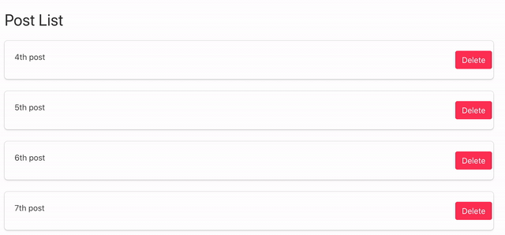

# Django_Delete_Confirmation_with_Bulma

[referred blog](https://narito.ninja/blog/detail/119/)


[How_to_use_Bulma_1](https://pypi.org/project/django-simple-bulma/)


[How_to_use_Bulma_2](https://github.com/timonweb/django-bulma)



> ## models.py
``` python
from django.db import models


class Post(models.Model):
	title = models.CharField(max_length=200, unique=True)

	def __str__(self):
		return self.title
```

> ## admin.py
``` python
from django.contrib import admin
from .models import Post

admin.site.register(Post)
```

> ## views.py
``` python
from django.urls import reverse_lazy
from .models import Post
from django.views import generic


class PostIndex(generic.ListView):
    model = Post

class PostDelete(generic.DeleteView):
    model = Post
    success_url = reverse_lazy('app:post_list')
```

> ## urls.py
``` python
from django.urls import path
from . import views

app_name = 'app'

urlpatterns = [
    path('', views.PostIndex.as_view(), name='post_list'),
    path('/delete/<int:pk>', views.PostDelete.as_view(), name='post_delete'),   
]
```

> ## base.html
``` python
<!DOCTYPE html>
<html>
<head>
    <meta charset="utf-8">
    <meta name="viewport" content="width=device-width, initial-scale=1">
    <title>Hello Bulma!</title>
    <link rel="stylesheet" href="https://cdnjs.cloudflare.com/ajax/libs/bulma/0.7.2/css/bulma.min.css">
    <script defer src="https://use.fontawesome.com/releases/v5.3.1/js/all.js"></script>
</head>
<body>


</body>
</html>
```

> ## page.html
``` python

```
